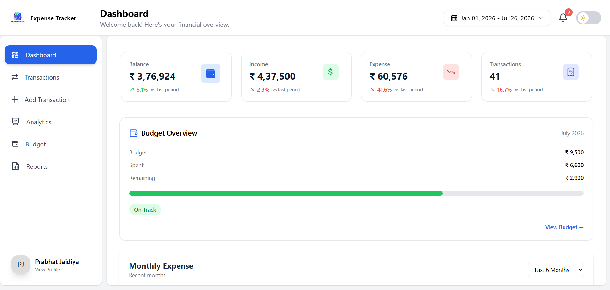
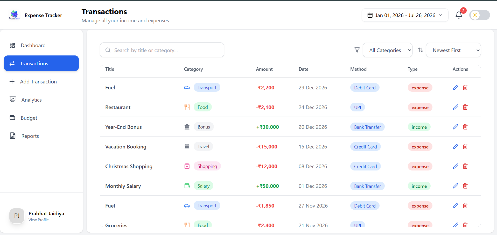
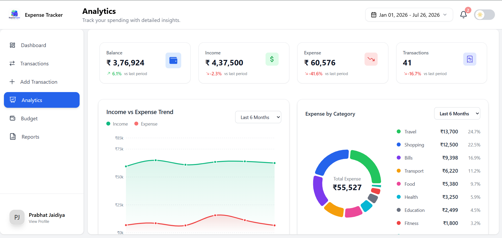
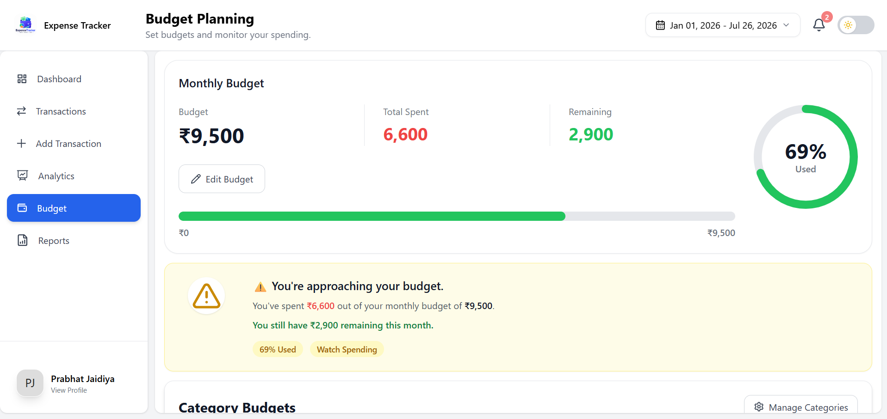
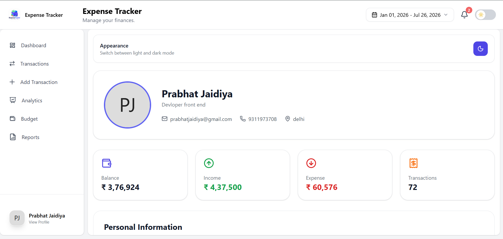
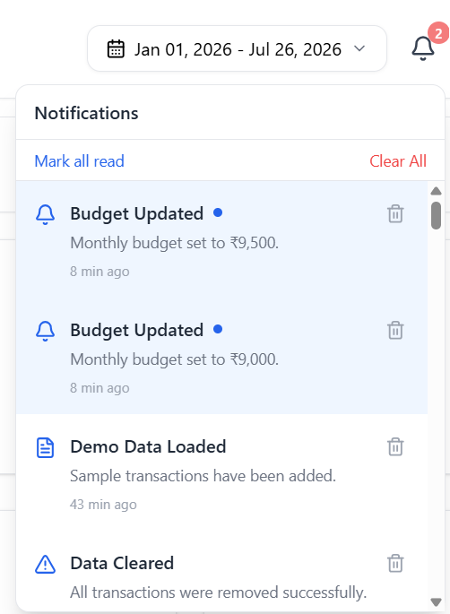
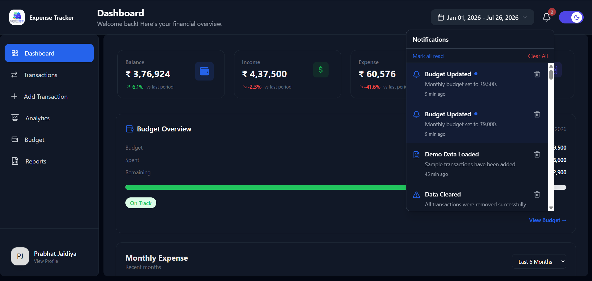

# 💰 Expense Tracker

<p align="center">
  
  
  
  
  
</p>

A modern, responsive and feature-rich **Expense Tracker** built with **React**, **Vite**, **Tailwind CSS**, and **Recharts** to help users manage their personal finances efficiently.

## 🌐 Live Demo

👉 https://expense-tracker-lovat-pi.vercel.app/

---

# ✨ Features

## 📊 Dashboard

- Financial overview
- Total Balance
- Total Income
- Total Expenses
- Total Transactions
- Recent Transactions
- Budget Summary
- Quick Statistics

---

## 💳 Transaction Management

- Add Transactions
- Edit Transactions
- Delete Transactions
- Search Transactions
- Filter by Category
- Filter by Type
- Sort by Date
- Sort by Amount

---

## 📈 Analytics

Interactive charts built using **Recharts**

- Monthly Income vs Expense
- Expense Trend
- Savings Trend
- Expense Categories
- Top Spending Categories
- Financial Insights

---

## 💸 Budget Management

- Monthly Budget
- Category Budgets
- Budget Progress
- Budget Alerts
- Remaining Budget
- Overspending Detection

---

## 🔔 Notification Center

Automatic notifications for

- Budget exceeded
- Budget warning
- Large expenses
- High income
- Monthly milestones
- Financial achievements

---

## 👤 Authentication

- Register
- Login
- Forgot Password
- Protected Routes
- User Session

---

## 👤 User Profile

- Edit Profile
- Upload Avatar
- Change Password
- Account Statistics
- Logout
- Delete Account
- Delete All Data

---

## 🌙 Dark Mode

- Light Theme
- Dark Theme
- Fully Responsive

---

## 📤 Export

- Export CSV
- Export PDF Report
- Export Dashboard PDF

---

# 📱 Responsive Design

✔ Desktop

✔ Tablet

✔ Mobile

---

# 🛠 Tech Stack

### Frontend

- React
- Vite
- Tailwind CSS
- React Router DOM
- Context API

### Charts

- Recharts

### Icons

- Lucide React
- React Icons

### Libraries

- React Datepicker
- React Toastify
- PapaParse
- File Saver
- jsPDF
- jsPDF AutoTable
- html2canvas

---

# 📂 Folder Structure

```text
src
│
├── assets
├── components
├── context
├── pages
├── utils
├── hooks
├── App.jsx
└── main.jsx
```

---

# 🚀 Getting Started

Clone the repository

```bash
git clone https://github.com/yourusername/expense-tracker.git
```

Move into project

```bash
cd expense-tracker
```

Install packages

```bash
npm install
```

Run locally

```bash
npm run dev
```

Production build

```bash
npm run build
```

Preview build

```bash
npm run preview
```

---

# 💾 Data Storage

Currently the project stores data using **Local Storage**

- User Accounts
- Transactions
- Budget
- Notifications
- Theme
- Profile

No backend required.

---

# 📷 Screenshots

Create a folder named **screenshots** inside your project.

```
expense-tracker
│
├── screenshots
│   ├── dashboard.png
│   ├── transactions.png
│   ├── analytics.png
│   ├── budget.png
│   ├── profile.png
│   ├── notifications.png
│   └── darkmode.png
```

Then add the following:

## Dashboard



---

## Transactions



---

## Analytics



---

## Budget



---

## Profile



---

## Notification Center



---

## Dark Mode



---

# 🎯 Future Improvements

- Recurring Transactions
- Savings Goals
- Investment Tracking
- Multi Currency Support
- Cloud Database
- AI Spending Insights
- Receipt Scanner
- Email Reports
- Progressive Web App (PWA)

---

# 📚 What I Learned

- React Fundamentals
- Context API
- State Management
- CRUD Operations
- Routing
- Local Storage
- Responsive Design
- Data Visualization
- Budget Calculations
- PDF & CSV Export
- Authentication
- Dark Mode Implementation

---

# 🤝 Contributing

Contributions are always welcome.

1. Fork the repository
2. Create your feature branch
3. Commit your changes
4. Push to the branch
5. Open a Pull Request

---

# 📄 License

This project is licensed under the MIT License.

---

# 👨‍💻 Author

**Prabhat Jaidiya**

If you like this project, don't forget to ⭐ the repository.